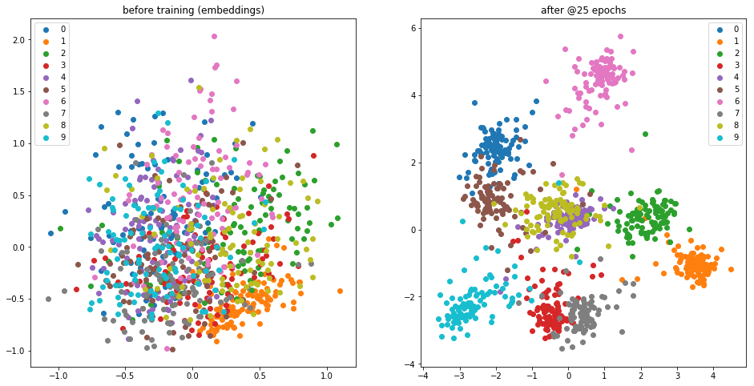
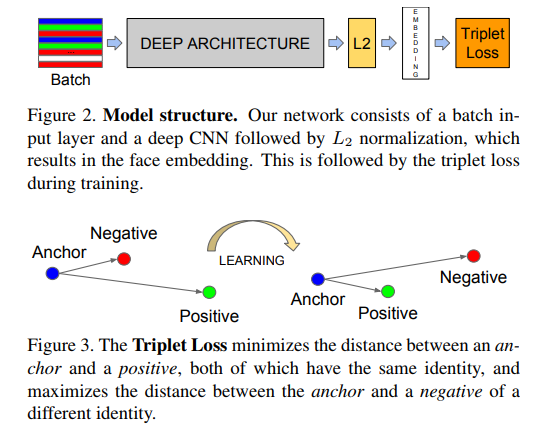
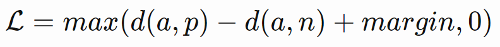
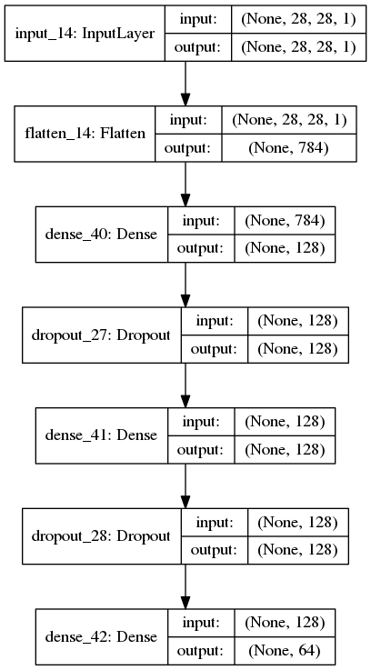
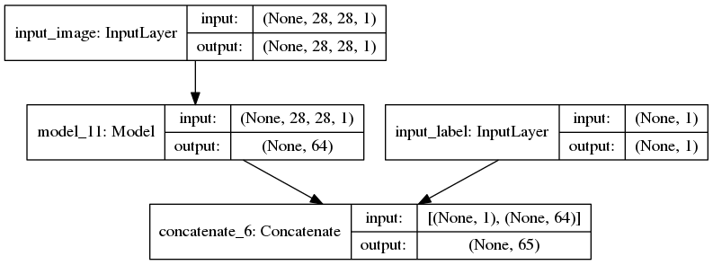

# Keras-Triplet-loss-MNIST
Train a Keras model using the Tensorflow function of semi-hard triplet loss, on the MNIST dataset.



**Disclaimer1**: the major contribution of this script lies in the combination of the tensorflow function with the Keras Model API. For this reason I had to define the function (as well as its support functions) locally.

### Please check out the *Tensorflow documentation page for the function* [here](https://www.tensorflow.org/api_docs/python/tf/contrib/losses/metric_learning/triplet_semihard_loss).
Make sure you are using the same tensorflow version!

### Python script can be found in the ipython notebook 'Triplet_loss_KERAS_semi_hard_from_TF.ipynb'

## Resources
* Keras 2.1.6
* Tensorflow 1.8.0

## Triplet Loss explained:


Figures taken from paper introducing Facenet(1). **Figure 2** represents the general idea of encoding images into a series of numbers much smaller than the image's size.

**Figure 3** presents the manner of training the network to differentiate between intra-class and inter-class cases. By pairing the images into triplet pairs of *Anchor-Positive* and *Anchor-Negative*, the network learns the distribution of images from each class with respect to all other classes.

The **loss function** is defined as:



Where *d(A,P)* and *d(A,N)* represent the Euclidean distances between the Anchor and the Positive and Negative pairs. *margin* is a parameter helping the network learning a specific distance between positive and negative samples (using the anchor).  

Positive and Negative pairs are important to training the network correctly. Ideally the Anchor-Positive templates should have large(r) distance between them whereas the Anchor-Negative templates should have small(er) distance. These represent **HARD examples**

## Preparing the network
First, the network architecture was defined, with an *Input* layer of the same shape as the input image (28x28) and an *Output* layer of size (64), representing the embedding.
```python
def create_base_network(image_input_shape, embedding_size):
    """
    Base network to be shared (eq. to feature extraction).
    """
    input_image = Input(shape=image_input_shape)

    x = Flatten()(input_image)
    x = Dense(128, activation='relu')(x)
    x = Dropout(0.1)(x)
    x = Dense(128, activation='relu')(x)
    x = Dropout(0.1)(x)
    x = Dense(embedding_size)(x)

    base_network = Model(inputs=input_image, outputs=x)
    plot_model(base_network, to_file='base_network.png', show_shapes=True, show_layer_names=True)
    return base_network
```



We then define the Model such that the Triplet Loss function receives all the embeddings from each batch, as well as their corresponding labels (used for determining the best triplet-pairs). This is done by defining an input layer for the labels and then concatenating it to the embeddings.
```python
  base_network = create_base_network(input_image_shape, embedding_size)

  input_images = Input(shape=input_image_shape, name='input_image') # input layer for images
  input_labels = Input(shape=(1,), name='input_label')    # input layer for labels
  embeddings = base_network([input_images])               # output of network -> embeddings
  labels_plus_embeddings = concatenate([input_labels, embeddings])  # concatenating the labels + embeddings

  # Defining a model with inputs (images, labels) and outputs (labels_plus_embeddings)
  model = Model(inputs=[input_images, input_labels],
                outputs=labels_plus_embeddings)
```


## Training
In order to train, we need to define some 'dummy' embeddings to pass as **ground truth (y)** values
```python
opt = Adam(lr=0.0001)  # choose optimiser. RMS is good too!
model.compile(loss=triplet_loss_lol, 
              optimizer=opt)

filepath = "semiH_trip_MNIST_v13_test_ep{epoch:02d}_BS%d.hdf5" % batch_size
checkpoint = ModelCheckpoint(filepath, monitor='val_loss', verbose=1, save_best_only=False, period=25)
callbacks_list = [checkpoint]

# Uses 'dummy' embeddings + dummy gt labels; removed as soon as they enter the loss function...
dummy_gt_train = np.zeros((len(x_train), embedding_size + 1))
dummy_gt_val = np.zeros((len(x_val), embedding_size + 1))

x_train = np.reshape(x_train, (len(x_train), x_train.shape[1], x_train.shape[1], 1))
x_val = np.reshape(x_val, (len(x_val), x_train.shape[1], x_train.shape[1], 1))
H = model.fit(x=[x_train,y_train],
            y=dummy_gt_train,
            batch_size=batch_size,
            epochs=epochs,
            validation_data=([x_val, y_val], dummy_gt_val),
            callbacks=callbacks_list)
```
## Visualizing separation of classes
We need to:
1. Make an empty network
```python
# creating an empty network
testing_embeddings = create_base_network(input_image_shape,
                                         embedding_size=embedding_size)
# embeddings before training...
x_embeddings_before_train = testing_embeddings.predict(np.reshape(x_test, (len(x_test), 28, 28, 1)))
```

2. Loop over the trained model and copy weights
```python
# Grabbing the weights from the trained network
for layer_target, layer_source in zip(testing_embeddings.layers, model.layers[2].layers):
  weights = layer_source.get_weights()
  layer_target.set_weights(weights)
  del weights
```

3. Obtain predictions (embeddings) for test set
```python
x_embeddings = testing_embeddings.predict(np.reshape(x_test, (len(x_test), 28, 28, 1)))
```

4. Obtain PCA decomposition
```python
dict_embeddings = {}
dict_gray = {}
test_class_labels = np.unique(np.array(y_test))

pca = PCA(n_components=no_of_components)
decomposed_embeddings = pca.fit_transform(x_embeddings)
decomposed_gray = pca.fit_transform(x_embeddings_before_train)
```
5. Visualize the separation...


### I hope this script will be helpful to anyone that wants to use Triplet Loss with Keras

## References and Other resources:

(1) F. Schroff and J. Philbin, “FaceNet: A Unified Embedding for Face Recognition and Clustering,” in Proceedings of the IEEE conference on computer vision and pattern recognition (CVPR), 2015, pp. 815–823. [arxiv link](https://arxiv.org/abs/1503.03832)

(2) [Blog post](https://omoindrot.github.io/triplet-loss) explaining Triplet loss very well. [Their github page](https://github.com/omoindrot/tensorflow-triplet-loss)

(3) A. Hermans, L. Beyer, and B. Leibe, “In Defense of the Triplet Loss for Person Re-Identification,” 2017. Loss [arxiv paper](https://arxiv.org/pdf/1703.07737.pdf)

(4) Semi-hard Triplet Loss function (tensorflow) [doc page](https://www.tensorflow.org/api_docs/python/tf/contrib/losses/metric_learning/triplet_semihard_loss)
