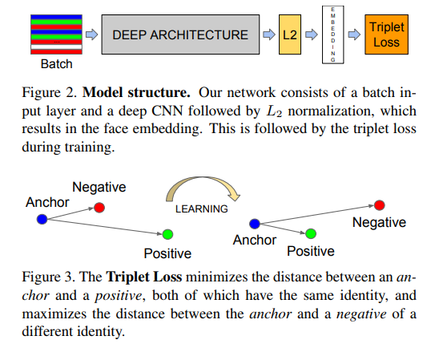
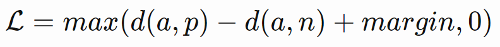
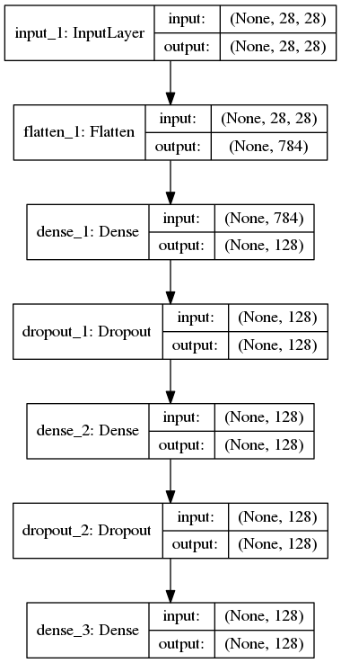
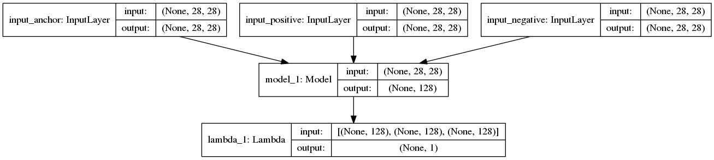
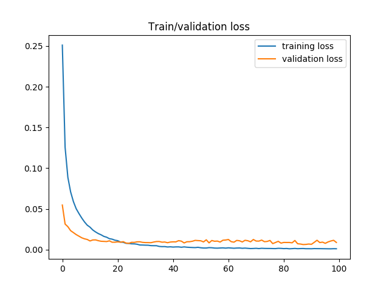
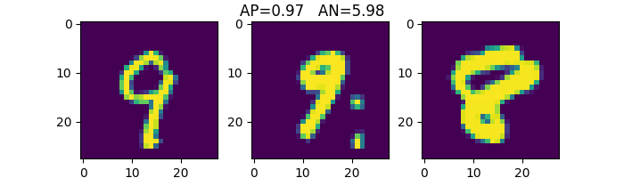
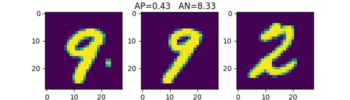
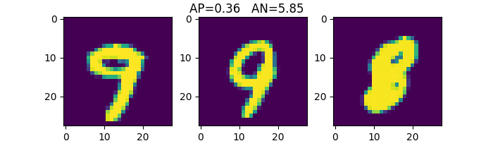
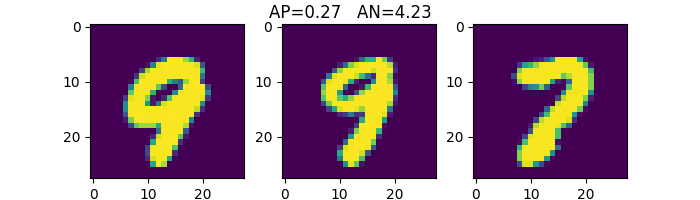

# Keras-Triplet-loss-MNIST
Train a Keras model using Triplet Loss function on MNIST dataset

Disclaimer: This script is based on the example of Siamese network provided by **Keras-team** found [here](https://github.com/keras-team/keras/blob/master/examples/mnist_siamese.py).

I have kept the network architecture, as well as the random way of generating the template pairs - (Anchor, Positive) and (Anchor, Negative)

## Resources
* Keras 2.1.6
* Tensorflow 1.8.0
* Tensorflow-gpu 1.8.0

## Triplet Loss explained:


Figures taken from paper introducing Facenet(1). **Figure 2** represents the general idea of encoding images into a series of numbers much smaller than the image's size.

**Figure 3** presents the manner of training the network to differentiate between intra-class and inter-class cases. By pairing the images into triplet pairs of *Anchor-Positive* and *Anchor-Negative*, the network learns the distribution of images from each class with respect to all other classes.

The **loss function** is defined as:



Where *d(A,P)* and *d(A,N)* represent the Euclidean distances between the Anchor and the Positive and Negative pairs. *margin* is a parameter helping the network learning a specific distance between positive and negative samples (using the anchor).  

Positive and Negative pairs are important to training the network correctly. Ideally the Anchor-Positive templates should have large(r) distance between them whereas the Anchor-Negative templates should have small(er) distance. These represent **HARD examples**

## Keras implementation
The main difficulty with implementing this training strategy in Keras was determine the best way of sharing layers' weights across the image pairs. If the Siamese network makes use of two networks being trained simultaneously, the Triplet loss uses 3 such networks. Being able to share weights makes the training step much quicker since there is both better memory usage and less redundancy in the training pairs (if there are 2 or 3 architectures declared). This is where the example for Siamese network provided by [**Keras-team**](https://github.com/keras-team/keras/blob/master/examples/mnist_siamese.py) came in handy.

First the network architecture was defined, with an *Input* layer of the same shape as the input image (28x28) and an *Output* layer of size (128), representing the embedding.



We then define 3 Input layers ( 'input_anchor', 'input_positive' and 'input_negative') and obtain the corresponding output, which is then fed into the **Model**:


Notice the output of the model, containing the concatenated embeddings corresponding to the 3 input images.

Subsequently a **Lambda layer** is defined which takes as input the 3 concatenated embeddings and computes the predicted distance using the Triplet loss.
```python
  input_a = Input(shape=input_shape, name='input_anchor')
  input_p = Input(shape=input_shape, name='input_positive')
  input_n = Input(shape=input_shape, name='input_negative')
    
  processed_a = base_network(input_a)
  processed_p = base_network(input_p)
  processed_n = base_network(input_n)

  distance = Lambda(triplet_euclidean_distance,
                    output_shape=eucl_dist_output_shape)([processed_a, processed_p, processed_n])

  model = Model(inputs=[input_a, input_p, input_n], outputs=distance)
  plot_model(model, to_file='model.png', show_shapes=True, show_layer_names=True)
```
The **Triplet loss** is defined previously as:
```python
def triplet_euclidean_distance(vects):
    '''
      Computes the Euclidean distance between (A,P) and (A,N)
    '''
    anch, pos, neg = vects
    anch_pos = K.sum(K.square(anch - pos), axis=1, keepdims=True)
    anch_neg = K.sum(K.square(anch - neg), axis=1, keepdims=True)
    return anch_pos - anch_neg

def triplet_loss(y_true, y_pred):
    del y_true # not required...
    margin = 0.5  # 0.2
    
    operator1 = margin + y_pred
    operator2 = K.epsilon()

    return K.mean(K.maximum(operator1, K.epsilon()))
```

The Model is defined with the 3 inputs and the distance computed using the triplet loss function.


After training for 100 EPOCHS, we plot the training and validation loss:


You can then load the weights from the trained model and copy them onto a new architecture using:
```python
# Grabbing the weights from the trained network
testing_embeddings = create_base_network(input_shape)  # creating an empty network
for layer_target, layer_source in zip(testing_embeddings.layers, model.layers[3].layers):
	weights = layer_source.get_weights()
	layer_target.set_weights(weights)
	del weights
```
Embeddings represent the output of the model (prediction) given an input image.


## Testing out the network
Computing the **Euclidean Distance** between intra-class images (AP) and inter-class (AN):







## Conclusions
* The distance between images from the same class (of numbers) is small, whereas the distance between images from different classes is large.
* Results can be improved if the pairs are generated based on comparing the Euclidean distances between intra and inter-class examples. 
* This script used a series of pairs that were randomly generated, which definitely does not deliver the best results. However, it is more than sufficient for the purpose of this script.

I hope this script will be helpful to anyone that wants to use Triplet Loss with Keras


## References:

(1) F. Schroff and J. Philbin, “FaceNet: A Unified Embedding for Face Recognition and Clustering,” in Proceedings of the IEEE conference on computer vision and pattern recognition (CVPR), 2015, pp. 815–823. 
